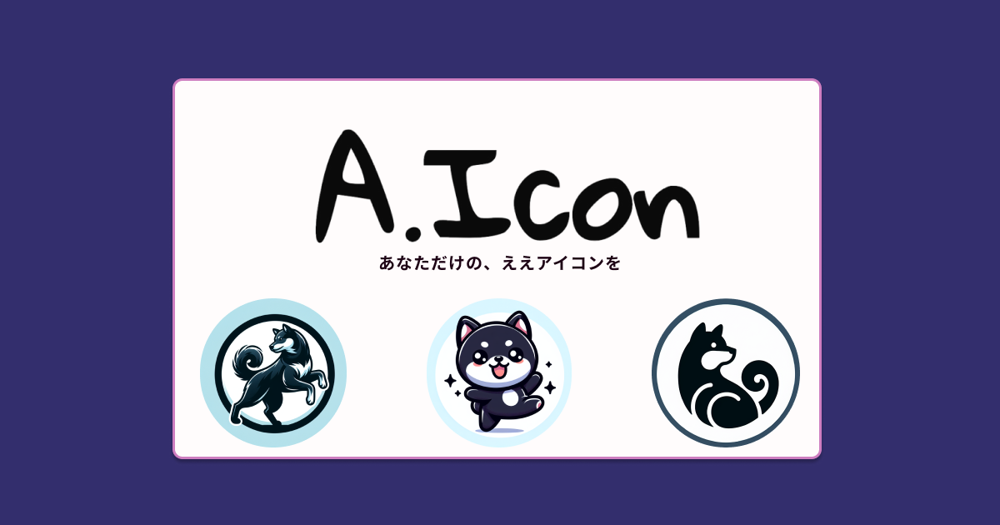

## ■サービス名
### [A.Icon（ええアイコン）](https://www.aicon-app.com/)
ゲストログインでお試しいただくことができます。

## ■サービス概要
A.IconはSNSなどのアイコンを何にしようか迷っている、困っている方向けのサービスになります。誰でも手軽にオリジナルアイコンを作成(AI画像生成)する機能に加え、他の方々がどのようなアイコンを使っているか確認することができます。
A.Iconは、あなたの「これだ！」と思えるアイコン探しをお手伝いします。もっと自分らしいアイコンを、一緒に見つけましょう。

## ■ このサービスへの思い・作りたい理由
SNSのプロフィールを新しく設定する際、どのアイコンを選ぶかで迷う経験は、皆さんにとってもあるのではないでしょうか。  
私もその一人です。「Xは仕事です」この一言で新しくアカウントを作成しましたが、顔となるアイコンを長く悩んだ末よくわからないパンダの写真に決めてしまっていました。
このような悩みを多くの人が持っていると気づき、「もっと手軽に、自分らしい」アイコンにすることができたらいいなと思いこのサービスの開発をしようと考えました。

## ■ ユーザー層について
アイコンを何しようか悩んでいる人、他の人がどんなアイコンにしてるか気になる人

## ■サービスの利用イメージ
### アイコン作成(AI画像生成)機能
SNSのアイコンを決めたいけど、どんな画像にするか迷っている時に使っていただけます。ユーザーは自分の好みのテイストやキーワードを入力するだけで、AIがそれに合ったアイコンをすぐに作成してくれます。
また、数パターンのテイストを変更でき自分好みに作成することができます。この機能はユーザー登録することで使用することができるようになります。

### アイコン専用フォルダ機能
ユーザーがAIで作成したアイコンや過去使用していたアイコンを保存することができます。タイトルや簡単な説明文を添えることができ、そこですぐに自分のアイコンを見ることができます。(共有するを選択するとみんなのアイコン一覧に表示されるようになります。)

### みんなのアイコン一覧機能
他のユーザーのアイコンを見ることができる機能です。いろんなアイコンを見ることが可能で、新しいアイコンのアイデアを得ることができます。また、お気に入りのアイコンには「いいね」をつけたり、コメントをしたりすることで、他のユーザーとの交流することができます。

## ■ ユーザーの獲得について
X(旧:Twitter)での発信

## ■ サービスの差別化ポイント・推しポイント
画像生成系のサービスはすでに多く存在(代表例：[canva](https://www.canva.com/ja_jp/))していますが、以下の点で差別化をしております。

### ・円形のアイコンに特化した画像生成
A.Iconは、SNSプロフィール画像などで頻繁に使用される円形のアイコン作成に特化しています。この特化により、ユーザーはSNS用のアイコンを手軽に、かつ迅速に作成することができます。さらに、SNSで使われるアイコンに向いている複数のテイストの中から選ぶことができます。

### ・みんなのアイコン一覧を通じたアイデアの共有
A.Iconには、他のユーザーが作成したアイコンを見ることができる「みんなのアイコン一覧」機能があります。この機能を通じて、ユーザーは他人のアイコンから新しいアイデアを得ることができます。他の画像生成サービスでは提供されていないこの機能は大きな特徴です。

## ■ 機能候補
* 会員登録
* ログイン
* アイコン生成機能
* 生成したアイコン投稿機能
  * いいね機能
  * Xシェア機能
* アイコン専用フォルダ
  * 生成したアイコンはここに保存
  * アイコン投稿機能
    * タイトルやコメントを記載できる(思いいれなど)
    * 共有ありにすることでみんなのアイコン一覧に表示される
* みんなのアイコン一覧機能
  * コメント機能
  * いいね機能
  * ソート機能
* プロフィールの設定
  *  いいねした投稿一覧

## ■使用予定技術
|カテゴリ|技術|
|:-------------|:------------|
|開発環境|Docker|
|使用言語|Ruby 3.2.2 /Rails 7系/JavaScript|
|ライブラリ|MiniMagick|
|データベース|PostgreSQL|
|インフラ| Render|
|Web API|OpenAI API|
|その他|AWS S3/Tailwindcss/daisyUI|

## ■現状考えている課題・検討事項
* 画像サイズの最適化(生成された画像サイズが大きすぎる) 
* 画像生成中のUXの低下(ActiveJobで改善できるか検証予定)
* OpenAIAPI以外のAPIの検討(GeminiAPIなど)

## ■画面遷移図
[画面遷移図](https://www.figma.com/file/r1CkCJNq8dRtqha5bFirlU/%E7%94%BB%E9%9D%A2%E9%81%B7%E7%A7%BB%E5%9B%B3?type=design&node-id=0-1&mode=design&t=7wbMxzTMZGb3KW1S-0)

## ■ER図

